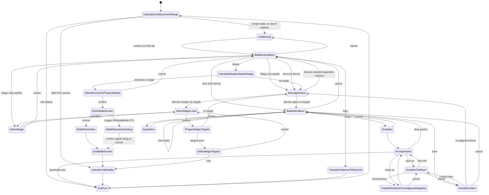

# Battle state machine (current)

High-level flow of the tactical battle loop. Instant states transition immediately in `Enter` (or early `Update`).

## Notes

- **MessageNotice**: primed message + return state; draws any filled range tints.
- **Input**: confirm Z/C, cancel X (`Core/Input.cs`).
- **Debug battle**: F1 debug before attack → one pose per frame + Left/Right scrub.
