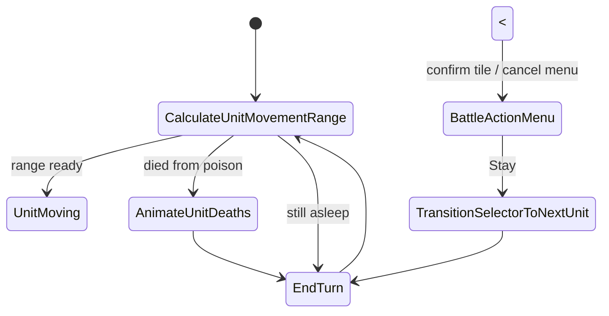
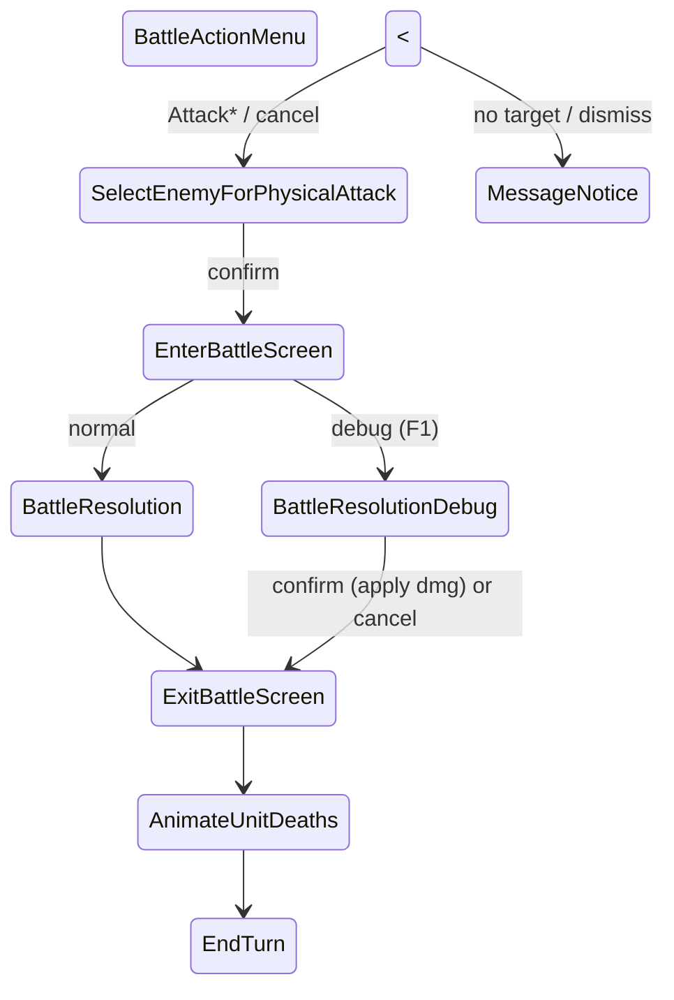
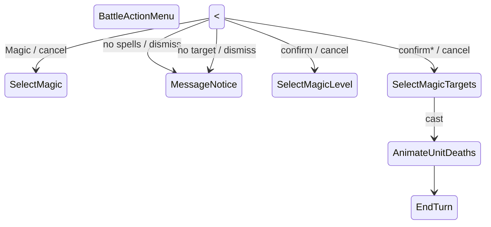
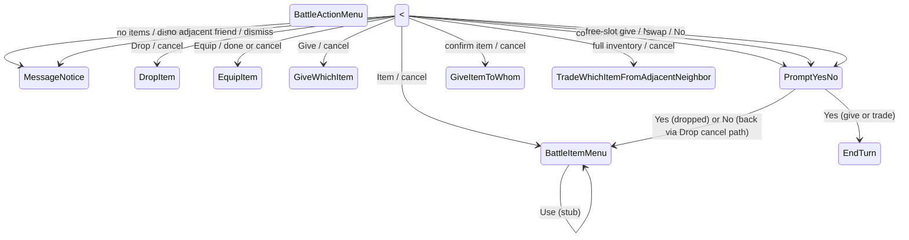

# Battle state machine

Flows are split so each menu stays readable. **Two-way arrows** (`A <--> B`) mean confirm (or entry) one way and cancel/dismiss the other. **One-way arrows** are pipelines with no simple reverse.

**Input:** confirm = Z/C, cancel = X (`Core/Input.cs`).

**MessageNotice:** shows a primed string and returns to a primed state (not a single fixed parent).

**Instant states** (transition in `Enter`, no lasting UI): `CalculateWeaponAttackRange`, `PrepareMagicTargets`, `EndTurn`, and often `CalculateUnitMovementRange` / `AnimateUnitDeaths` when they only hop.

---

## 1. Core turn loop

Shared hub. Action menu is the branch point for Attack / Magic / Item / Stay.

From **BattleActionMenu** (see sections below):

| Command | Enters |
|---------|--------|
| Attack | Attack flow |
| Magic | Magic flow (or MessageNotice if no spells) |
| Item | Item flow (or MessageNotice if no items) |
| Stay | `TransitionSelectorToNextUnit` → `EndTurn` |

---

## 2. Attack flow

\* **Instant hop:** `CalculateWeaponAttackRange` runs between menu and target select (or MessageNotice if no enemies).

**MessageNotice** return for no attack target: `BattleActionMenu`.

**Debug:** F1 before confirming the attack so `AttackContext` builds one pose per frame; Left/Right scrub in `BattleResolutionDebug`.

---

## 3. Magic flow

\* **Instant hop:** `PrepareMagicTargets` between level confirm and target select (or MessageNotice if no valid targets).

**MessageNotice** returns:

| Reason | Return state |
|--------|----------------|
| No spells | `BattleActionMenu` |
| No magic targets | `SelectMagicLevel` |

---

## 4. Item flow

**MessageNotice** (no give target) returns to `BattleItemMenu`.

**PromptYesNo** is primed per action (`ReturnStateOnYes` / `ReturnStateOnNo`):

| Action | Yes | No |
|--------|-----|-----|
| Drop | `BattleItemMenu` | `DropItem` |
| Give (free slot) | `EndTurn` | `GiveItemToWhom` |
| Trade (swap) | `EndTurn` | `TradeWhichItemFromAdjacentNeighbor` |

**Equip** always returns to `BattleItemMenu` (confirm equip or cancel).

---

## 5. Shared notes

| Topic | Detail |
|-------|--------|
| Confirm / cancel | Z or C / X |
| MessageNotice | Primed message + return state; may still draw range tints |
| Instant states | No lasting UI; hop in `Enter` |
| End of successful combat actions | Usually `AnimateUnitDeaths` → `EndTurn` (physical after battle exit; magic after cast) |
| Give/trade success | `PromptYesNo` Yes → `EndTurn` (skips death anim unless HP already 0) |
