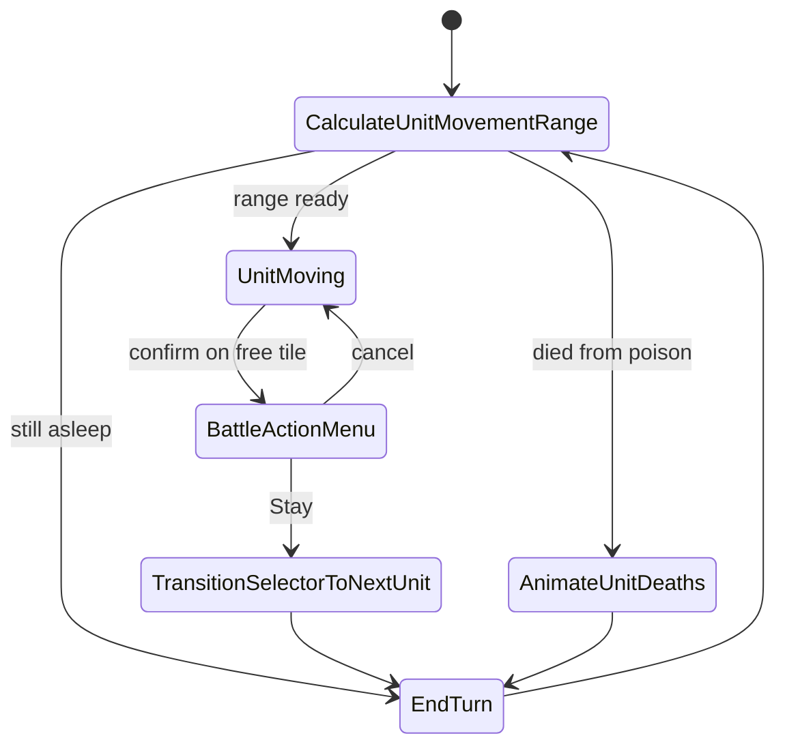
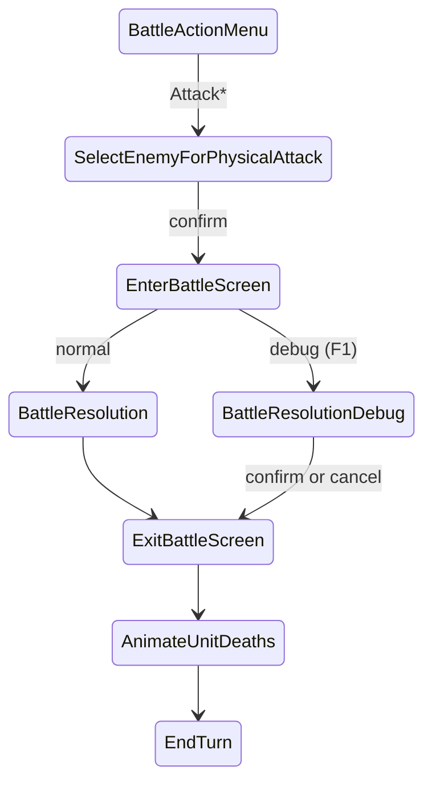
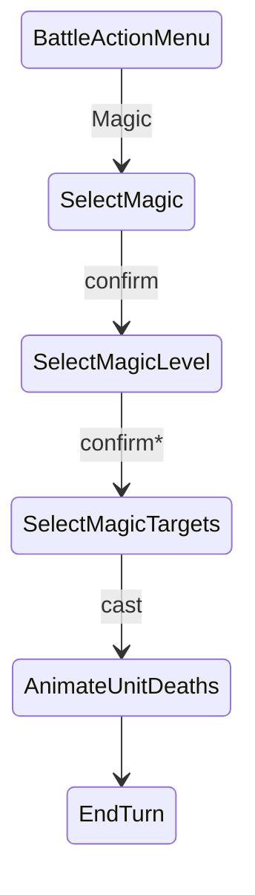
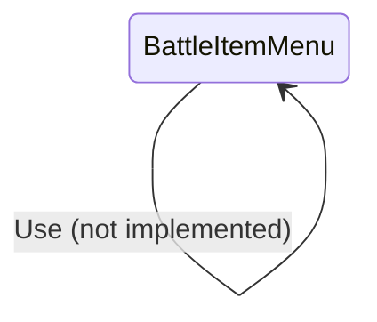
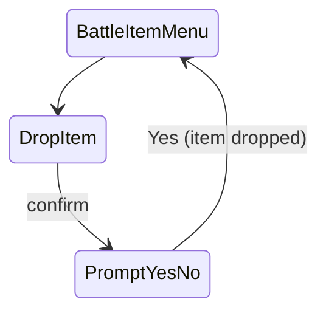
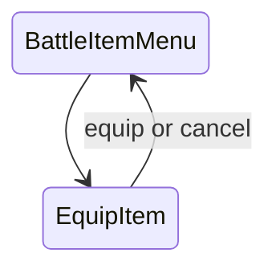
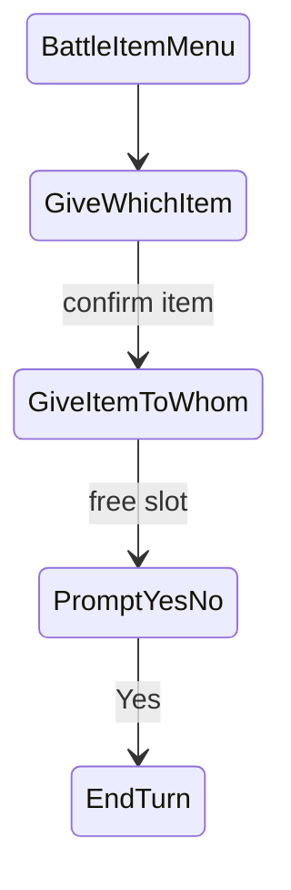
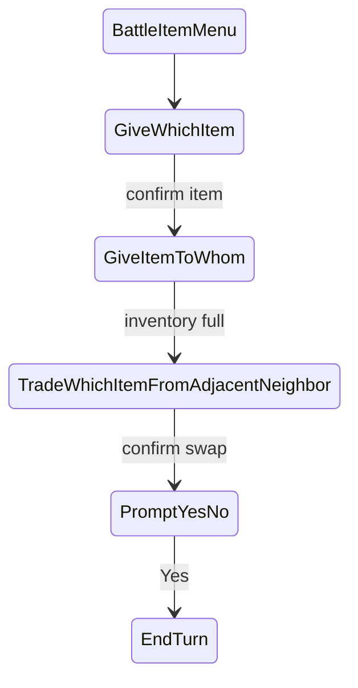

# Battle state machine

Each section is a **happy path** (top → bottom). Cancel / failure cases sit in a short table under the diagram so the graph stays linear.

**Input:** confirm = Z/C, cancel = X (`Core/Input.cs`).

**MessageNotice:** primed message + return state.

**Instant states** (hop in `Enter`, little or no UI): `CalculateWeaponAttackRange`, `PrepareMagicTargets`, `EndTurn`, and sometimes start-of-turn / death hops.

---

## 1. Core turn loop

Shared hub. From **BattleActionMenu**, pick Attack / Magic / Item / Stay (sections 2–4).

| At | Other |
|----|--------|
| Action menu | Magic with no spells → MessageNotice → action menu |
| Action menu | Item with no items → MessageNotice → action menu |

---

## 2. Attack

\* Instant hop: `CalculateWeaponAttackRange` (then targets or no-target notice).

| At | Cancel / edge case |
|----|---------------------|
| After range calc | No enemies → MessageNotice → BattleActionMenu |
| SelectEnemyForPhysicalAttack | X → BattleActionMenu |
| BattleResolutionDebug | Z/C apply damage then exit; X exit without damage |

**Debug:** F1 before confirming the attack so the sequence is built for scrubbing (Left/Right).

---

## 3. Magic

\* Instant hop: `PrepareMagicTargets` (then targets or no-target notice).

| At | Cancel / edge case |
|----|---------------------|
| Action menu | No spells → MessageNotice → BattleActionMenu |
| SelectMagic | X → BattleActionMenu |
| SelectMagicLevel | X → SelectMagic |
| After prepare | No targets → MessageNotice → SelectMagicLevel |
| SelectMagicTargets | X → SelectMagicLevel |

---

## 4. Items

From the action menu: **Item** → `BattleItemMenu` (or MessageNotice if no items).  
**X** on item menu → BattleActionMenu.

### 4a. Use (stub)

### 4b. Drop

| At | Cancel / edge case |
|----|---------------------|
| DropItem | X → BattleItemMenu |
| PromptYesNo No | → DropItem (then X to leave) |

### 4c. Equip

### 4d. Give

Both paths share the start: **BattleItemMenu → GiveWhichItem → GiveItemToWhom**.  
Then either a free-slot give or a full-inventory swap.

#### Give — free slot (recipient has empty inventory space)

#### Give — swap (recipient inventory full)

#### Give — cancel / failure (both paths)

| At | X / fail |
|----|----------|
| GiveWhichItem | → BattleItemMenu |
| GiveWhichItem (no adjacent friend) | MessageNotice → BattleItemMenu |
| GiveItemToWhom | → GiveWhichItem |
| TradeWhichItemFromAdjacentNeighbor | → GiveItemToWhom |
| PromptYesNo No (free give) | → GiveItemToWhom |
| PromptYesNo No (swap) | → TradeWhichItemFromAdjacentNeighbor |

---

## 5. Shared notes

| Topic | Detail |
|-------|--------|
| Confirm / cancel | Z or C / X |
| MessageNotice | Message + return state; may still draw range tints |
| Instant states | Range calc, prepare magic, end turn |
| Physical kill/hit presentation | Battle screen pipeline (section 2) |
| Magic success | Cast → death anim → end turn (no side battle screen yet) |
| Give/trade success | Prompt Yes → EndTurn |
